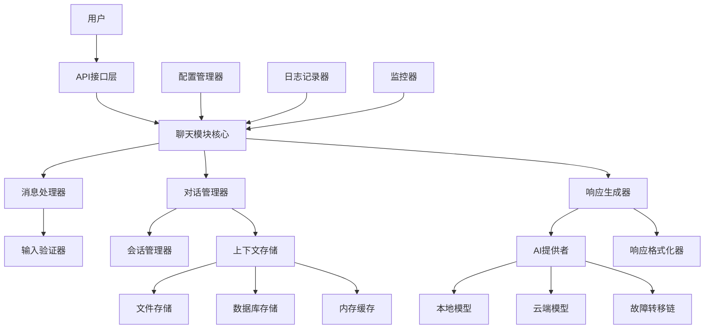

# 设计文档

## 概述

AI聊天模块是一个模块化的对话式AI系统，设计用于处理用户交互、维护对话上下文并提供智能响应。该模块采用分层架构，支持多种AI模型提供者，具有强大的错误处理和恢复能力。

核心设计原则：
- **模块化**: 每个组件都有明确的职责和接口
- **可扩展性**: 支持插件架构和多种AI模型
- **韧性**: 具备故障转移和错误恢复机制
- **性能**: 优化的上下文管理和响应时间
- **可配置性**: 灵活的配置系统支持不同用例

该模块将集成到现有的`ai/`目录结构中，作为一个独立的`chat/`子目录，与现有的`deep_learning/`、`machine_learning/`和`prompt/`目录并列。

## 架构

### 系统架构图



### 分层架构

1. **接口层**: 处理外部请求和响应
2. **业务逻辑层**: 核心聊天功能和对话管理
3. **服务层**: AI模型集成和上下文管理
4. **数据层**: 持久化存储和缓存
5. **基础设施层**: 配置、日志和监控

## 组件和接口

### 核心组件

#### 1. 聊天模块核心 (ChatModule)

```python
class ChatModule:
    """聊天模块的主要协调器"""
    
    def __init__(self, config: ChatConfig):
        self.message_handler = MessageHandler()
        self.conversation_manager = ConversationManager()
        self.response_generator = ResponseGenerator()
        self.config = config
    
    async def process_message(self, session_id: str, message: str) -> ChatResponse:
        """处理用户消息并返回响应"""
        pass
    
    def create_session(self) -> str:
        """创建新的对话会话"""
        pass
    
    def end_session(self, session_id: str) -> bool:
        """结束指定的对话会话"""
        pass
```

#### 2. 消息处理器 (MessageHandler)

```python
class MessageHandler:
    """处理和验证用户消息"""
    
    def validate_message(self, message: str) -> ValidationResult:
        """验证消息格式和内容"""
        pass
    
    def preprocess_message(self, message: str) -> str:
        """预处理消息（清理、标准化）"""
        pass
    
    def extract_intent(self, message: str) -> Intent:
        """提取消息意图（可选功能）"""
        pass
```

#### 3. 对话管理器 (ConversationManager)

```python
class ConversationManager:
    """管理对话状态和上下文"""
    
    def __init__(self, context_store: ContextStore):
        self.context_store = context_store
        self.session_manager = SessionManager()
    
    async def get_context(self, session_id: str, limit: int = 10) -> List[Message]:
        """获取对话上下文"""
        pass
    
    async def add_message(self, session_id: str, message: Message) -> None:
        """添加消息到对话历史"""
        pass
    
    def manage_context_window(self, session_id: str) -> None:
        """管理上下文窗口大小"""
        pass
```

#### 4. AI提供者 (AIProvider)

```python
class AIProvider:
    """AI模型提供者的统一接口"""
    
    def __init__(self, config: AIConfig):
        self.models = self._initialize_models(config)
        self.fallback_chain = FallbackChain(config.fallback_models)
    
    async def generate_response(self, context: List[Message], message: str) -> AIResponse:
        """生成AI响应，支持故障转移"""
        pass
    
    def switch_model(self, model_name: str) -> bool:
        """切换AI模型"""
        pass
    
    def get_available_models(self) -> List[str]:
        """获取可用的AI模型列表"""
        pass
```

#### 5. 上下文存储 (ContextStore)

```python
class ContextStore:
    """对话上下文的持久化存储"""
    
    def __init__(self, storage_backend: StorageBackend):
        self.storage = storage_backend
        self.memory_cache = MemoryCache()
    
    async def save_message(self, session_id: str, message: Message) -> None:
        """保存消息到存储"""
        pass
    
    async def get_conversation_history(self, session_id: str, limit: int) -> List[Message]:
        """获取对话历史"""
        pass
    
    async def backup_data(self) -> bool:
        """备份对话数据"""
        pass
```

### 接口定义

#### 消息接口

```python
@dataclass
class Message:
    """消息数据结构"""
    id: str
    session_id: str
    content: str
    role: MessageRole  # USER, ASSISTANT, SYSTEM
    timestamp: datetime
    metadata: Dict[str, Any]

@dataclass
class ChatResponse:
    """聊天响应数据结构"""
    message: str
    session_id: str
    response_time: float
    model_used: str
    confidence: float
    metadata: Dict[str, Any]
```

#### 配置接口

```python
@dataclass
class ChatConfig:
    """聊天模块配置"""
    max_message_length: int = 4000
    context_window_size: int = 10
    response_timeout: int = 5
    storage_backend: str = "file"
    ai_models: List[str] = None
    fallback_models: List[str] = None
    log_level: str = "INFO"
```

## 数据模型

### 核心数据结构

#### 1. 会话模型

```python
@dataclass
class Session:
    """对话会话模型"""
    id: str
    created_at: datetime
    last_activity: datetime
    status: SessionStatus  # ACTIVE, INACTIVE, ENDED
    metadata: Dict[str, Any]
    message_count: int
    
    def is_expired(self, timeout_hours: int = 24) -> bool:
        """检查会话是否过期"""
        return (datetime.now() - self.last_activity).hours > timeout_hours
```

#### 2. AI响应模型

```python
@dataclass
class AIResponse:
    """AI模型响应"""
    content: str
    model_name: str
    confidence_score: float
    processing_time: float
    token_usage: TokenUsage
    error: Optional[str] = None
    
@dataclass
class TokenUsage:
    """令牌使用统计"""
    prompt_tokens: int
    completion_tokens: int
    total_tokens: int
```

#### 3. 错误模型

```python
@dataclass
class ChatError:
    """聊天错误信息"""
    code: str
    message: str
    details: Dict[str, Any]
    timestamp: datetime
    session_id: Optional[str] = None
    recoverable: bool = True
```

### 数据流

1. **消息输入流**: 用户输入 → 验证 → 预处理 → 上下文检索
2. **AI处理流**: 上下文 + 消息 → AI模型 → 响应生成 → 格式化
3. **存储流**: 消息 → 验证 → 持久化 → 缓存更新
4. **错误处理流**: 错误检测 → 日志记录 → 恢复策略 → 用户通知

### 存储架构

#### 文件存储结构
```
ai/chat/data/
├── sessions/
│   ├── {session_id}.json
│   └── index.json
├── conversations/
│   ├── {session_id}/
│   │   ├── messages.jsonl
│   │   └── metadata.json
└── backups/
    └── {timestamp}/
```

#### 数据库模式（可选）
```sql
-- 会话表
CREATE TABLE sessions (
    id VARCHAR(36) PRIMARY KEY,
    created_at TIMESTAMP,
    last_activity TIMESTAMP,
    status VARCHAR(20),
    metadata JSON
);

-- 消息表
CREATE TABLE messages (
    id VARCHAR(36) PRIMARY KEY,
    session_id VARCHAR(36),
    content TEXT,
    role VARCHAR(20),
    timestamp TIMESTAMP,
    metadata JSON,
    FOREIGN KEY (session_id) REFERENCES sessions(id)
);
```

## 错误处理

### 错误分类

1. **输入错误**: 无效消息格式、超长消息
2. **系统错误**: AI模型不可用、存储失败
3. **网络错误**: 连接超时、API限制
4. **配置错误**: 无效配置参数、缺失API密钥

### 错误处理策略

#### 1. 重试机制

```python
class RetryStrategy:
    """重试策略实现"""
    
    def __init__(self, max_retries: int = 3, backoff_factor: float = 2.0):
        self.max_retries = max_retries
        self.backoff_factor = backoff_factor
    
    async def execute_with_retry(self, func: Callable, *args, **kwargs):
        """执行带重试的函数调用"""
        for attempt in range(self.max_retries):
            try:
                return await func(*args, **kwargs)
            except RetryableError as e:
                if attempt == self.max_retries - 1:
                    raise
                await asyncio.sleep(self.backoff_factor ** attempt)
```

#### 2. 故障转移

```python
class FallbackChain:
    """AI模型故障转移链"""
    
    def __init__(self, models: List[str]):
        self.models = models
        self.current_index = 0
    
    async def try_next_model(self, context: List[Message], message: str) -> AIResponse:
        """尝试下一个可用模型"""
        for i in range(len(self.models)):
            model = self.models[(self.current_index + i) % len(self.models)]
            try:
                return await self._call_model(model, context, message)
            except ModelError:
                continue
        raise AllModelsFailedError("所有AI模型都不可用")
```

#### 3. 优雅降级

```python
class GracefulDegradation:
    """优雅降级处理"""
    
    def handle_storage_failure(self, session_id: str, message: Message):
        """存储失败时的处理"""
        # 保存到内存缓存
        self.memory_backup[session_id].append(message)
        # 设置恢复任务
        self.schedule_recovery_task(session_id)
    
    def handle_ai_failure(self, message: str) -> str:
        """AI模型失败时的默认响应"""
        return "抱歉，我现在无法处理您的请求。请稍后再试。"
```

## 测试策略

### 测试方法

本项目采用双重测试方法：

1. **单元测试**: 验证具体示例、边界情况和错误条件
2. **基于属性的测试**: 验证跨所有输入的通用属性

单元测试专注于具体的功能点和集成点，而基于属性的测试通过随机化输入提供全面的覆盖。两者相辅相成，确保全面的测试覆盖（单元测试捕获具体错误，属性测试验证通用正确性）。

### 基于属性的测试配置

- 使用Python的`hypothesis`库进行基于属性的测试
- 每个属性测试最少运行100次迭代（由于随机化）
- 每个属性测试必须引用其设计文档属性
- 标签格式：**Feature: ai-chat-module, Property {number}: {property_text}**
- 每个正确性属性必须由单个基于属性的测试实现

### 测试覆盖范围

1. **功能测试**: 核心聊天功能、消息处理、上下文管理
2. **集成测试**: AI模型集成、存储系统、配置管理
3. **性能测试**: 响应时间、并发处理、内存使用
4. **错误测试**: 故障转移、错误恢复、边界条件
5. **安全测试**: 输入验证、数据保护、访问控制

### 测试环境

- **开发环境**: 本地测试，模拟AI模型
- **集成环境**: 真实AI模型，测试数据库
- **生产环境**: 健康检查，监控测试

## 正确性属性

*属性是在系统的所有有效执行中都应该成立的特征或行为——本质上是关于系统应该做什么的正式陈述。属性作为人类可读规范和机器可验证正确性保证之间的桥梁。*

基于需求文档中的验收标准，以下属性定义了AI聊天模块必须满足的正确性保证：

### 属性1: 消息处理响应生成
*对于任何*有效的文本消息，聊天模块应该处理该消息并生成适当的非空响应
**验证需求: 1.1**

### 属性2: 输入验证一致性
*对于任何*输入字符串，消息处理器应该一致地将其分类为有效或无效，并为无效输入返回描述性错误消息
**验证需求: 1.2, 1.3**

### 属性3: 响应时间性能
*对于任何*标准查询消息，聊天模块应该在5秒内完成处理并返回响应
**验证需求: 1.4**

### 属性4: 会话唯一标识符生成
*对于任何*新会话创建请求，对话管理器应该分配一个唯一的会话标识符，该标识符与所有现有会话ID不同
**验证需求: 2.1, 4.2**

### 属性5: 消息持久化往返一致性
*对于任何*有效的消息对象，将其存储到上下文存储然后检索应该产生等价的消息对象（JSON序列化往返）
**验证需求: 2.2, 5.1**

### 属性6: 上下文窗口管理
*对于任何*包含超过10条消息的对话会话，响应生成器应该只考虑最近的10条消息作为上下文
**验证需求: 2.3**

### 属性7: 大会话性能维护
*对于任何*包含超过100条消息的会话，系统应该继续正常运行而不出现性能降级
**验证需求: 2.4**

### 属性8: 对话状态持久化
*对于任何*活跃的对话会话，在系统重启后应该能够恢复相同的对话状态和历史
**验证需求: 2.5**

### 属性9: AI提供者接口一致性
*对于任何*支持的AI模型，都应该通过相同的统一接口进行访问，返回相同格式的响应结构
**验证需求: 3.1**

### 属性10: AI模型故障转移
*对于任何*AI模型失败的情况，AI提供者应该自动切换到备用模型并继续提供服务
**验证需求: 3.2**

### 属性11: 模型切换对话连续性
*对于任何*正在进行的对话，切换AI模型不应该影响对话上下文和历史的连续性
**验证需求: 3.3**

### 属性12: 多类型模型支持
*对于任何*本地或云端AI模型，AI提供者应该能够正确集成和使用它们
**验证需求: 3.4**

### 属性13: AI响应验证和格式化
*对于任何*AI模型返回的响应，响应生成器应该验证其有效性并格式化为标准的聊天响应格式
**验证需求: 3.5**

### 属性14: 并发会话隔离
*对于任何*多个并发的对话会话，每个会话应该维护独立的上下文，不会相互干扰
**验证需求: 4.1, 4.3**

### 属性15: 会话生命周期管理
*对于任何*超过24小时不活跃的会话，会话管理器应该将其标记为待清理状态
**验证需求: 4.4**

### 属性16: 会话终止操作
*对于任何*用户请求结束的会话，会话管理器应该成功终止该会话并清理相关资源
**验证需求: 4.5**

### 属性17: 原子存储操作
*对于任何*并发的存储操作，上下文存储应该确保数据完整性，不会出现部分写入或数据损坏
**验证需求: 5.2**

### 属性18: 多后端存储支持
*对于任何*支持的存储后端（文件或数据库），上下文存储应该提供相同的功能和数据一致性
**验证需求: 5.3**

### 属性19: 时间顺序数据检索
*对于任何*对话历史检索请求，上下文存储应该按照消息的时间戳顺序返回数据
**验证需求: 5.4**

### 属性20: 数据备份恢复往返
*对于任何*存储的对话数据，执行备份然后恢复操作应该产生完全相同的数据
**验证需求: 5.5**

### 属性21: 指数退避重试机制
*对于任何*AI模型请求失败，AI提供者应该使用指数退避策略重试最多3次，每次间隔时间递增
**验证需求: 6.1**

### 属性22: 存储故障内存备份
*对于任何*存储操作失败的情况，上下文存储应该在内存中维护数据备份直到存储恢复
**验证需求: 6.2**

### 属性23: 网络中断消息队列
*对于任何*网络连接中断的情况，聊天模块应该将消息排队，并在连接恢复时按顺序处理
**验证需求: 6.3**

### 属性24: 错误处理和用户友好消息
*对于任何*系统错误，聊天模块应该记录详细的技术信息用于调试，同时向用户提供友好的错误消息
**验证需求: 6.4, 6.5**

### 属性25: 配置文件加载和默认值
*对于任何*配置加载请求，聊天模块应该能够从外部文件加载配置，或在文件不存在时使用合理的默认值
**验证需求: 7.1, 7.5**

### 属性26: 配置热重载
*对于任何*配置文件的修改，聊天模块应该能够动态重载配置而无需重启系统
**验证需求: 7.2**

### 属性27: 插件架构扩展
*对于任何*符合插件接口的扩展模块，聊天模块应该能够动态加载并集成其功能
**验证需求: 7.3**

### 属性28: 配置参数验证
*对于任何*配置参数，配置管理器应该在系统启动时验证其有效性，拒绝无效配置
**验证需求: 7.4**

### 属性29: 可配置日志记录
*对于任何*用户交互，聊天模块应该根据配置的详细级别记录相应的日志信息
**验证需求: 8.1**

### 属性30: 性能监控和警报
*对于任何*性能指标超过预设阈值的情况，监控器应该生成相应的警报通知
**验证需求: 8.2**

### 属性31: 指标收集准确性
*对于任何*系统操作，聊天模块应该准确跟踪和记录响应时间、错误率和使用统计
**验证需求: 8.3**

### 属性32: 结构化日志格式
*对于任何*生成的日志条目，日志记录器应该输出有效的JSON格式以便后续分析
**验证需求: 8.4**

### 属性33: 健康检查端点
*对于任何*健康检查请求，聊天模块应该返回准确的系统健康状态信息
**验证需求: 8.5**